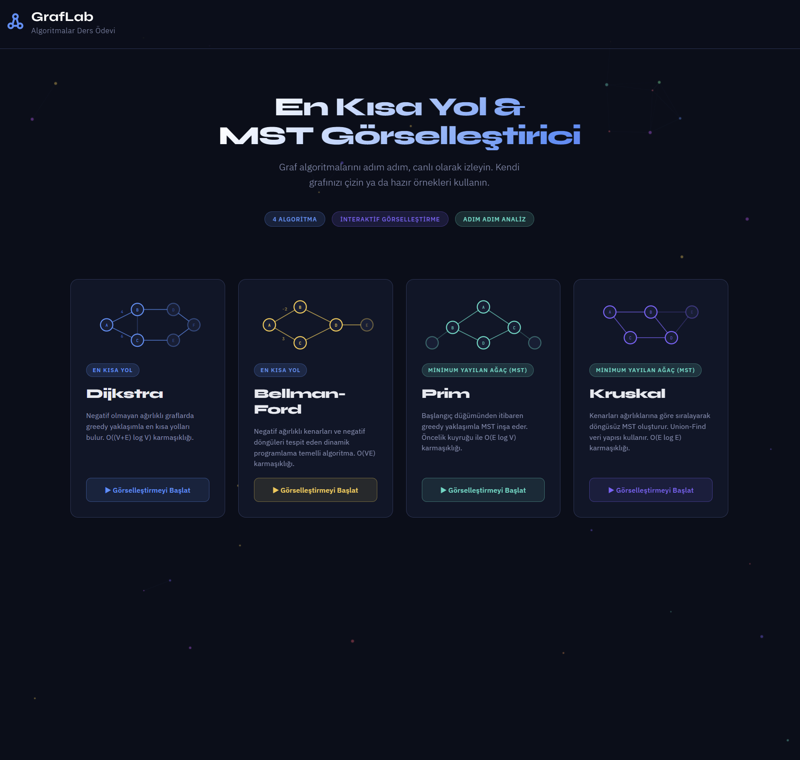
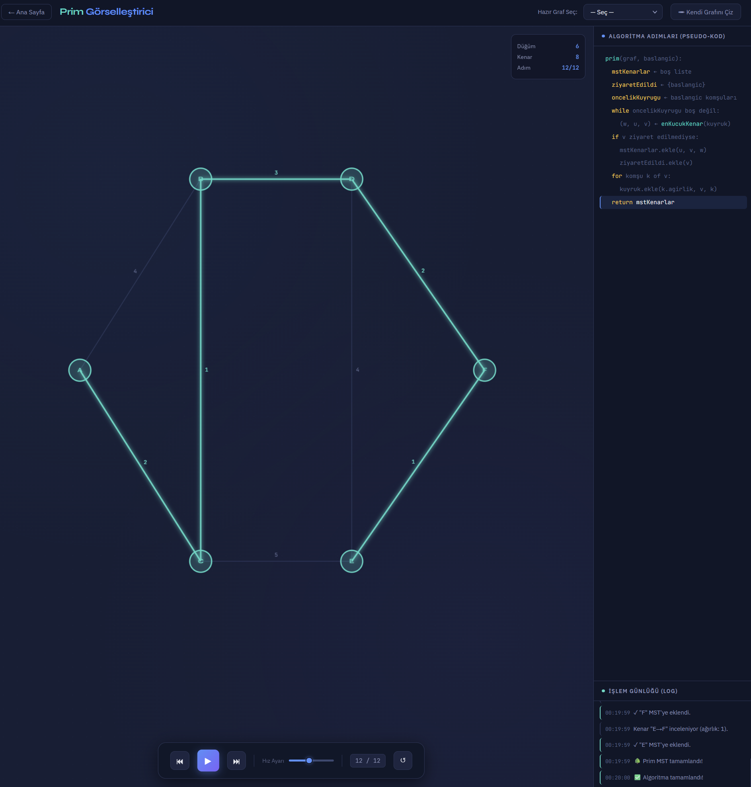

# Graph Algorithm Visualizer

🔗 Live Demo: https://raufeken.github.io/graph-algorithm-visualizer/

An interactive web-based visualization project for fundamental graph algorithms.

## Overview

This project visualizes shortest path and minimum spanning tree algorithms step by step. Users can select a predefined graph, draw custom nodes and edges, assign edge weights, and observe algorithm execution visually.

The project was developed as part of an Algorithms course.

## Screenshots

### Home Page


### Visualization Screen


## Algorithms Included

- Dijkstra Shortest Path Algorithm
- Bellman-Ford Shortest Path Algorithm
- Prim Minimum Spanning Tree Algorithm
- Kruskal Minimum Spanning Tree Algorithm

## Technologies Used

- HTML5
- CSS3
- JavaScript
- Canvas API

## Features

- Interactive graph drawing
- Custom node and weighted edge creation
- Predefined graph examples
- Step-by-step algorithm animation
- Pseudocode panel for each algorithm
- Distance table and execution log
- Responsive interface

## Project Structure

```text
graph-algorithm-visualizer/
├── index.html
├── style.css
├── app.js
├── assets/
│   └── screenshots/
│       ├── homepage.png
│       └── visualization-screen.png
└── README.md
```

## How to Run

Clone or download the repository and open `index.html` in a modern web browser.

```bash
git clone https://github.com/raufeken/graph-algorithm-visualizer.git
cd graph-algorithm-visualizer
```

Then open:

```text
index.html
```

## Educational Purpose

This project was created to understand and demonstrate how graph algorithms work internally. It focuses on algorithm behavior, visualization, and step-by-step learning.

## Türkçe Özet

Bu proje, Dijkstra, Bellman-Ford, Prim ve Kruskal algoritmalarını adım adım görselleştirmek amacıyla geliştirilmiş web tabanlı bir algoritma uygulamasıdır. Kullanıcı hazır graf seçebilir, kendi grafını çizebilir, kenar ağırlıkları belirleyebilir ve algoritmanın çalışma sürecini görsel olarak takip edebilir.
